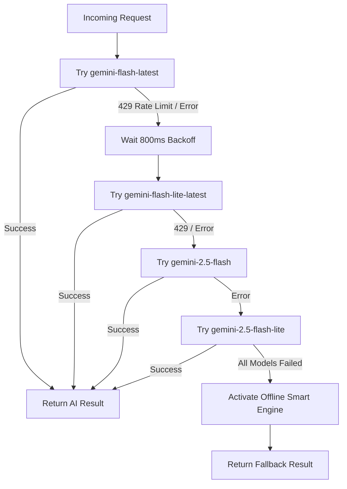

# Say It Right — Phase 1 Blueprint (As-Built Specification)
## Word Pronunciation & Message Tone Rewriter

**Project:** Say It Right  
**Phase:** 1  
**Version:** 1.0 (Production / As-Built)  
**Status:** Completed & Deployed  
**Repository:** [Eric092925/say-it-right](https://github.com/Eric092925/say-it-right)  
**Primary Objective:** Deliver an instant, dual-mode English communication assistant enabling users to hear authentic regional pronunciation and elevate written messages into polished, executive-ready communication.

---

# 1. Phase 1 Overview

**Say It Right** is a modern, responsive web application designed to solve two core challenges in everyday English communication:

1. **Pronunciation Confidence:** Enabling non-native and native English speakers to look up tricky words, global names, and regional place names, learn their meaning, view clear phonetic respellings and International Phonetic Alphabet (IPA) notation, and listen to natural audio in regional accents.
2. **Written Message Polishing:** Transforming rough, informal, or grammatically awkward drafts into professional, context-appropriate communication across five distinct emotional and organizational tones.

### Core Proposition

> **Pronounce it better. Write it better.**

The application is built for frictionless usage: **no user account, login, or installation required**. Users can navigate to the site, type their input, and receive immediate results in under two seconds.

---

# 2. Supported Accents

Phase 1 provides authentic reference support for the three major global English variants:

| Accent | Flag | BCP-47 Locale | Description |
| :--- | :---: | :---: | :--- |
| **Australian English** | 🇦🇺 | `en-AU` | Default accent. Optimized for Australian vowels, place names (e.g., Maroubra, Woolloomooloo), and colloquial terms. |
| **British English** | 🇬🇧 | `en-GB` | Non-rhotic Received Pronunciation (RP) reference, British place names (e.g., Worcestershire, Gloucester). |
| **American English** | 🇺🇸 | `en-US` | General American rhotic reference. |

---

# 3. System Architecture & Tech Stack

```text
SAY IT RIGHT (Phase 1)
│
├── Client Layer (Browser)
│   ├── Next.js 15 App Router (React 19, TypeScript)
│   ├── Tailwind CSS (Responsive, Light/Dark theme)
│   ├── Lucide React Icons
│   └── Web Speech API (SpeechSynthesis with locale voice resolution)
│
├── Serverless API Layer (Vercel Node.js Runtime)
│   ├── POST /api/ai (Unified Word & Message processing)
│   └── GET /api/ai-test (Health check, model discovery, diagnostic tests)
│
└── Engine & AI Providers
    ├── Primary: Google Gemini Flash (gemini-flash-latest, v1beta REST)
    ├── Secondary Failover: Google Gemini Flash-Lite (gemini-flash-lite-latest)
    ├── Tertiary Failover: Google Gemini 2.5 Flash / Flash-Lite
    └── Offline Fallback: Local Dynamic Dictionary & Smart Proposal Rewriter
```

### Key Dependencies
- **Framework:** Next.js 15.1.0 (App Router)
- **UI Library:** React 19.0.0
- **Language:** TypeScript 5.7.2
- **Styling:** Tailwind CSS 3.4.16 with `clsx` and `tailwind-merge`
- **Icons:** `lucide-react`
- **Hosting & CI/CD:** Vercel automated deployments via GitHub `main` branch

---

# 4. Navigation & Page Structure

```text
Say It Right
│
├── Header
│   ├── Logo ("Say It Right" with gradient text)
│   ├── Theme Toggle (Light / Dark mode switch)
│   └── External Navigation (About, Privacy, Terms)
│
├── Hero Section
│   └── Badge: "Pronounce it better. Write it better."
│
├── Mode Selector
│   ├── [ Word Mode ]
│   └── [ Message Mode ]
│
├── Active Viewport
│   ├── Mode 1: Word Mode Input & Result Card
│   └── Mode 2: Message Mode Input & Result Card
│
└── Footer
    ├── Copyright notice
    └── Navigation links (About, Privacy, Terms)
```

---

# 5. Word Mode Specification

Word Mode gives users instant phonetic, linguistic, and audio clarity on any word or place name.

```text
┌─────────────────────────────────────────────────────────────┐
│ What do you want to say?                                    │
│ ┌─────────────────────────────────────────────────────────┐ │
│ │ Enter a word, name or place... (e.g., Maroubra)         │ │
│ └─────────────────────────────────────────────────────────┘ │
│ English style: [ 🇦🇺 Australian ▼ ]                          │
│                                           [ Say It Right ]  │
└─────────────────────────────────────────────────────────────┘
```

### 5.1 Input Rules
- Text input capped at 100 characters.
- Accent selector dropdown (Australian, British, American).
- Enter key triggers immediate search.

### 5.2 Output Result Card
- **Word Title:** Formatted with standard capitalization.
- **Accent Switcher:** Integrated directly into the card header for one-click cross-accent comparisons without re-submitting.
- **Meaning Block:** Concise definition or geographical background (1–2 sentences).
- **Easy Pronunciation:** Syllable-by-syllable phonetic respelling with capitalized primary stress (e.g., `muh-ROO-bruh`, `WOOS-tuh-shuh`).
- **IPA Notation:** Authentic International Phonetic Alphabet symbols tailored to the chosen accent (e.g., `/məˈruːbrə/`).
- **Listen Button:** Plays authentic regional speech synthesis.

---

# 6. Message Mode Specification

Message Mode transforms rough drafts into polished, high-impact messages tailored to specific communication contexts.

```text
┌─────────────────────────────────────────────────────────────┐
│ Your original message:                                      │
│ ┌─────────────────────────────────────────────────────────┐ │
│ │ I think operations, logistics and finance can be moved  │ │
│ │ to Asia in view of low revenue                          │ │
│ └─────────────────────────────────────────────────────────┘ │
│ Choose tone:                                                │
│ [ 👔 Professional ] [ 😊 Friendly ] [ 🤝 Polite ]           │
│ [ 🦁 Confident ]    [ ☕ Casual ]                           │
│                                           [ Polish Message ] │
└─────────────────────────────────────────────────────────────┘
```

### 6.1 Tone Definitions

| Tone | Emoji | Target Persona & Guidelines |
| :--- | :---: | :--- |
| **Professional** | 👔 | Business-ready, authoritative, rationale-first. Leads with operational/strategic context (e.g., *"Given current revenue constraints..."*), removes tentative language, uses executive vocabulary. |
| **Friendly** | 😊 | Warm, engaging, approachable, collaborative, while maintaining organizational credibility. |
| **Polite** | 🤝 | Courteous, diplomatic, considerate, gracious with respectful framing. |
| **Confident** | 🦁 | Direct, assertive, active voice, decisive, and action-oriented. |
| **Casual** | ☕ | Relaxed, conversational, effortless, natural phrasing. |

### 6.2 On-Demand Single-Version Generation (Latency Optimization)

To eliminate 8–10s response latency caused by batching multiple variations at once, Phase 1 implements **On-Demand Single-Version Generation**:

1. **Initial Submission:** Server generates **Version 1** (~1.2s response time) using a Strategic/Executive angle.
2. **Regenerate Button:** User can click **Regenerate (1/3)** to generate **Version 2** (Collaborative/Diplomatic angle) and **Version 3** (Direct/Action-Oriented angle) on demand.
3. **Exclusion Constraints:** When generating subsequent versions, previous version texts are passed to the prompt to guarantee fresh, non-repetitive phrasing.
4. **Cap:** Maximum 3 improved versions per message.

### 6.3 Result Card Features
- **Header:** Tone badge + AI Model indicator (`✨ AI Powered (gemini-flash-latest)` or `⚡ Smart Engine`).
- **Version Selector Dropdown:**
  - `Original Draft` (displays user's raw input)
  - `Version 1`
  - `Version 2` (when generated)
  - `Version 3` (when generated)
- **Action Toolbar:**
  - **Copy Button:** Copies active version to clipboard with visual feedback.
  - **Listen Button:** Reads the improved version aloud (or reads the original draft if selected).
  - **Regenerate Button:** Displays `Regenerate (X/3)` or `Regenerate (3/3 limit reached)`.

---

# 7. AI Engine & Quota Resilience Architecture

The AI engine is hosted in `src/lib/ai.ts` and accessed via the serverless API route `src/app/api/ai/route.ts`.

### 7.1 Multi-Model Quota Pool Failover

To resolve Google Gemini Free Tier burst rate limits (HTTP 429), the backend executes a sequential model cascade:



### 7.2 Safety & Privacy Controls
- Server-side API key protection (`AI_API_KEY`, `GEMINI_API_KEY`). Keys are never sent to or exposed in client bundles.
- Request timeout: 12 seconds per attempt via `AbortController`.
- Structured JSON output enforcement (`responseMimeType: "application/json"`).
- Strict input sanitization and character length bounds (100 chars for Word, 5,000 chars for Message).

---

# 8. Offline Fallback & Smart Engine

If Google Gemini API is unreachable or rate-limited, Say It Right activates its built-in Smart Engine in `src/lib/fallback-data.ts`:

### 8.1 Word Mode Knowledge Base
- Curated linguistic database covering 50+ difficult place names and loanwords:
  - **Australian Suburbs:** Maroubra, Bondi, Coogee, Woolloomooloo, Cronulla, Toowoomba, Cairns, Canberra, etc.
  - **British Towns & Counties:** Worcestershire, Gloucester, Leicester, Edinburgh, Bicester, etc.
  - **Tricky Words:** Quinoa, Gnocchi, Açaí, Charcuterie, Pseudonym, etc.
- Dynamic dictionary engine providing fallback syllable stress and IPA generation.

### 8.2 Message Mode Executive Rewriter
- **Proposal Detection:** Recognizes business statements, strategic opinions, and operational shifts (detecting keywords: `think`, `relocate`, `move`, `revenue`, `costs`, `margin`, `strategy`, `transition`).
- **Clause Transformation:** Replaces passive voice and weak qualifiers with natural executive phrasing:
  - *Input:* "I think operations, logistics and finance can be moved to Asia in view of low revenue"
  - *Output (Professional):* *"Given current revenue constraints and margin considerations, we should evaluate relocating operations, logistics, and finance to Asia to optimize costs and enhance operational efficiency."*
- **Request Detection:** Formats inquiries, updates, reviews, and greetings cleanly without awkward double-nesting.

---

# 9. Audio Playback Engine (`src/lib/speech.ts`)

- **Technology:** Web Speech API (`window.speechSynthesis`).
- **Voice Resolution Hierarchy:**
  1. Exact BCP-47 locale match (`en-AU`, `en-GB`, `en-US`).
  2. Voice name / subtag match (`Australian`, `British`, `UK`, `American`, `US`).
  3. Generic English voice (`en-*`).
  4. System default voice.
- **Browser Compatibility Workarounds:**
  - Auto-resumes `speechSynthesis` if stuck in Chromium paused state.
  - Clears pending utterances with `cancel()` before queueing new speech.
  - Automatically handles unmount teardown to prevent speech leaks when navigating.

---

# 10. Repository File Manifest

```text
say-it-right/
├── src/
│   ├── app/
│   │   ├── api/
│   │   │   ├── ai/
│   │   │   │   └── route.ts             # POST handler for Word and Message processing
│   │   │   └── ai-test/
│   │   │       └── route.ts             # Diagnostic route for key verification and model discovery
│   │   ├── about/page.tsx               # About page
│   │   ├── privacy/page.tsx             # Privacy policy
│   │   ├── terms/page.tsx               # Terms of service
│   │   ├── globals.css                  # Tailwind styles and theme CSS variables
│   │   ├── layout.tsx                   # Root layout, metadata, viewport
│   │   ├── page.tsx                     # Main application page (Mode switching & state)
│   │   ├── icon.tsx                     # Dynamic favicon generation
│   │   └── manifest.ts                  # PWA web manifest
│   ├── components/
│   │   ├── AccentSelector.tsx           # Accent dropdown component
│   │   ├── CopyButton.tsx               # Clipboard copy utility with feedback
│   │   ├── Footer.tsx                   # Page footer
│   │   ├── Header.tsx                   # Page header with logo and theme toggle
│   │   ├── ListenButton.tsx             # Audio playback button
│   │   ├── MessageInput.tsx             # Text area and tone selection for Message mode
│   │   ├── MessageResult.tsx            # Result card for rewritten messages
│   │   ├── ModeSelector.tsx             # Pill tab selector (Word vs Message)
│   │   ├── ThemeToggle.tsx              # Dark/Light mode toggle switch
│   │   ├── ToneSelector.tsx             # 5 tone button group
│   │   ├── VersionSelector.tsx          # Dropdown for Original vs improved versions
│   │   ├── WordInput.tsx                # Input field and accent picker for Word mode
│   │   └── WordResult.tsx               # Result card for pronunciation, IPA, and meaning
│   └── lib/
│       ├── ai.ts                        # Gemini API client, model cascade, and prompt templates
│       ├── fallback-data.ts             # Curated pronunciation database & smart tone templates
│       ├── speech.ts                    # SpeechSynthesis engine & voice resolution
│       ├── types.ts                     # TypeScript interfaces and constants
│       └── validation.ts                # AI response JSON parsing and validation
├── package.json                         # Dependencies & scripts
├── tsconfig.json                        # TypeScript configuration
└── tailwind.config.ts                   # Tailwind theme tokens
```

---

# 11. Phase 1 Completion Checklist

- [x] Word Mode with Meaning, Syllable Stress Pronunciation, and IPA notation.
- [x] SpeechSynthesis audio playback for Australian, British, and American accents.
- [x] Message Mode with 5 selectable tones.
- [x] On-demand single-version generation (Version 1 instant, Versions 2 & 3 on demand).
- [x] Copy to clipboard and audio playback for all message versions and original draft.
- [x] Multi-model Gemini failover (`gemini-flash-latest` -> `gemini-flash-lite-latest` -> `gemini-2.5-flash`).
- [x] Burst rate-limit resilience with 800ms backoff.
- [x] Upgraded Smart Engine fallback producing executive-level phrasing.
- [x] Dark / Light theme toggle with local storage persistence.
- [x] Responsive layout optimized for mobile, tablet, and desktop.
- [x] Automated CI/CD deployment verified on Vercel.
